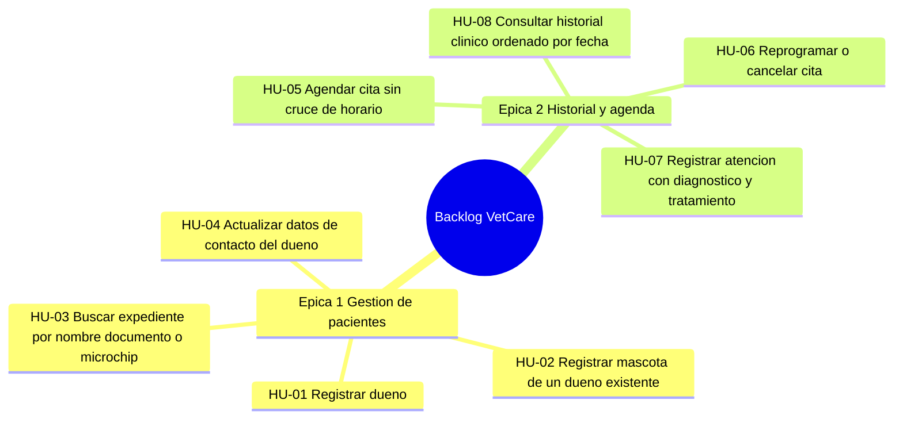

# Taller de la Clase 7 en ExamLab - configuracion

- **Curso:** Seminario de Sistemas (FI303301)
- **Taller:** Taller Clase 7 en ExamLab - Historias de usuario y backlog de VetCare
- **Preguntas:** 5 · **Total:** 100 puntos
- **Plataforma:** ExamLab (https://uniaj.examlab.workers.dev/) · modulo Talleres
- **Hito del PI:** Queda listo el backlog inicial de VetCare: dos epicas descompuestas en ocho historias priorizadas, con criterios de aceptacion y talla en puntos.
- **Entregable de la clase:** Tablero de backlog con 8 historias en formato Como/quiero/para, cada una con 2 o 3 criterios de aceptacion en Dado-Cuando-Entonces, estimacion en puntos y trazabilidad al RF de la clase 6, subido a ExamLab.

> ExamLab no importa preguntas desde archivo: el alta se hace en la UI del
> docente (o con la pestana de IA). Este documento trae el texto exacto de cada
> campo para copiar y pegar, incluidos el SQL de partida y el codigo base.

**Que produce el estudiante:** El estudiante entrega dos epicas descompuestas en ocho historias con rol concreto, criterios Dado-Cuando-Entonces, revision INVEST, estimacion en puntos y trazabilidad al RF de origen.

---

## Pregunta 1 - Respuesta escrita · 30 pts

**Tipo en la plataforma:** `abierta`

**Enunciado (campo Contenido):**

## Dos epicas y ocho historias trazadas al catalogo

Tome el catalogo de la clase 6 (RF-01 a RF-08) y agrupelo en **exactamente 2 epicas** de VetCare. Sugerencia: `Epica 1 - Gestion de pacientes` y `Epica 2 - Historial y agenda`.

**Parte A - Epicas.** Para cada epica escriba: nombre, objetivo en **una linea** y que RF agrupa (lista de IDs).

**Parte B - Ocho historias.** Entregue una tabla markdown con **exactamente 8 filas** y **estas 5 columnas**:

`| ID | Epica | Historia (Como / quiero / para) | RF de origen | Prioridad |`

Reglas duras:
- Formato literal: `Como <rol de la clinica Huellitas> quiero <accion> para <beneficio>`.
- Roles validos: **Recepcionista, Veterinario, Administrador**. La palabra **«usuario» esta prohibida** y anula la fila.
- El `para` debe ser un beneficio del negocio, no una repeticion de la accion. Mal: «para poder registrar la mascota». Bien: «para no volver a pedirle los datos al dueno en cada visita».
- Las historias deben ser **cortes verticales**: cada una entrega valor completo al rol. **Prohibido** cortar por capas tecnicas (nada de «crear la base de datos», «hacer el backend de mascotas», «disenar la pantalla»).
- Toda historia debe declarar su **RF de origen** y ningun RF del catalogo puede quedar sin al menos una historia.

**Rubrica esperada (campo Rubrica):**

Dos epicas con objetivo y RF agrupados. Ocho historias en formato Como/quiero/para con roles concretos de Huellitas, sin la palabra usuario, con beneficio real y no tautologico. Todas son cortes verticales de valor y traen RF de origen; el catalogo queda cubierto sin RF sueltos.

---

## Pregunta 2 - Respuesta escrita · 25 pts

**Tipo en la plataforma:** `abierta`

**Enunciado (campo Contenido):**

## Criterios de aceptacion en Dado-Cuando-Entonces

Escriba los criterios de aceptacion de **3 de sus 8 historias**, obligatoriamente estas tres situaciones de VetCare:

1. La historia de **registrar una mascota de un dueno que ya existe**.
2. La historia de **buscar el expediente de una mascota**.
3. La historia de **agendar una cita con un veterinario**.

Para cada historia entregue **3 criterios** con esta estructura exacta:

```
HU-0x <titulo>  (trazabilidad: RF-0x)
CA-1 (camino feliz):
  Dado que ...
  Cuando ...
  Entonces ...
CA-2 (camino alterno):
  Dado que ...
  Cuando ...
  Entonces ...
CA-3 (error o validacion):
  Dado que ...
  Cuando ...
  Entonces ...
```

Escenarios alternos obligatorios (uno por historia, en el orden de arriba):
- Registrar mascota: el documento del dueno **ya esta registrado**, entonces el sistema no vuelve a pedir sus datos.
- Buscar expediente: la busqueda devuelve **varias mascotas con el mismo nombre**, entonces el sistema muestra columnas que permiten desambiguar (diga cuales).
- Agendar cita: el veterinario **ya tiene una cita a esa hora**, entonces el sistema la rechaza y propone alternativas.

Cada `Entonces` debe indicar un resultado observable: el mensaje exacto entre comillas, el codigo generado o el estado en que queda el registro.

**Rubrica esperada (campo Rubrica):**

Nueve criterios en total (3 por historia) en Dado-Cuando-Entonces, con los tres escenarios alternos exigidos textualmente resueltos. Los Entonces nombran mensaje exacto, codigo generado o estado del registro. Cada historia trae su RF de origen.

---

## Pregunta 3 - Respuesta escrita · 15 pts

**Tipo en la plataforma:** `abierta`

**Enunciado (campo Contenido):**

## Revision INVEST y reparacion de una historia mal escrita

Un equipo entrego esta historia para VetCare:

> «Como usuario quiero un CRUD completo de mascotas, duenos, citas, atenciones y facturas con su base de datos y sus pantallas, para tener el sistema funcionando.»

**Parte A - Diagnostico INVEST.** Evalue esa historia contra las **6 letras** de INVEST. Use exactamente este formato, una linea por letra:

`I (Independiente): SI/NO - <razon en media linea>`

y asi con N (Negociable), V (Valiosa), E (Estimable), S (Small o pequeña) y T (Testeable o verificable). Diga al final **cuantas letras falla**.

**Parte B - Reparacion.** Como falla dos o mas letras, **partala en 3 historias** bien escritas, con rol concreto de Huellitas, corte **vertical** (nunca por capas) y su RF de origen. Escriba las 3 en formato Como/quiero/para.

**Parte C.** En 2 renglones explique **por que partirla por capas tecnicas** (una historia para la base de datos, otra para la pantalla, otra para la logica) **seria un error** desde el punto de vista de lo que la clinica puede ver y aprobar.

**Rubrica esperada (campo Rubrica):**

Las 6 letras evaluadas con SI/NO y razon, y el conteo de fallas. Tres historias de reemplazo bien formuladas, con rol concreto, corte vertical y RF de origen. Los 2 renglones finales argumentan en terminos de valor visible para el cliente, no de comodidad del equipo.

---

## Pregunta 4 - Diagrama (Mermaid) · 15 pts

**Tipo en la plataforma:** `diagrama`

**Enunciado (campo Contenido):**

## Mapa del backlog en Mermaid

Represente la descomposicion de su backlog con un **mindmap de Mermaid**.

Estructura obligatoria:
- Raiz: `root((Backlog VetCare))`
- **2 ramas de primer nivel**, una por epica, con el nombre exacto de sus epicas.
- Bajo cada epica, **4 hojas** (8 historias en total), cada una escrita como `HU-0x <accion corta>` y en el mismo orden de prioridad de su backlog.

La jerarquia va solo por indentacion (2 espacios por nivel), sin guiones al inicio, sin parentesis en las hojas y sin tildes. La suma debe dar exactamente 8 historias: si le sobran o le faltan, el backlog de la primera pregunta esta mal.

**Pegar al final del enunciado — flujo de entrega del diagrama:**

**Del boceto al codigo Mermaid.** No subas una imagen: la respuesta de esta pregunta es texto Mermaid.

- **1. Disena visual** Dibuja el diagrama como quieras en Excalidraw o draw.io: es mas rapido arrastrar cajas que escribir codigo, y ahi es donde piensas el modelo.
- **2. Traduce con IA** Copia o describe tu boceto a una IA y pidele el codigo Mermaid: «convierte este diagrama a Mermaid usando `mindmap`». Revisa el resultado: la IA acierta la sintaxis, no tu modelo.
- **3. Pega y renderiza en ExamLab** Pega ese codigo en la caja de texto de la pregunta y mira como lo dibuja la plataforma. Si no renderiza, corrige ahi mismo: lo que se califica es el diagrama renderizado dentro de ExamLab.
- **4. Guarda el PNG para tu PI** Exporta tambien la imagen a la carpeta de tu Proyecto Integrador. Esa copia es para tu informe; no reemplaza la respuesta en la plataforma.

**Diagrama de referencia (Mermaid):**



**Rubrica esperada (campo Rubrica):**

Mindmap valido con raiz Backlog VetCare, 2 ramas con los nombres de las epicas declaradas y exactamente 4 hojas por epica, cada hoja con codigo HU y accion corta. Debe coincidir una a una con las 8 historias de la primera pregunta.

---

## Pregunta 5 - Respuesta escrita · 15 pts

**Tipo en la plataforma:** `abierta`

**Enunciado (campo Contenido):**

## Estimacion relativa y orden del backlog

Estime sus **8 historias** en puntos con la escala **1, 2, 3, 5, 8**. La referencia fija del curso es: **«registrar un dueno» = 3 puntos**. Todo lo demas se estima comparando contra esa historia, no en horas.

Entregue una tabla markdown con **8 filas** y **estas 5 columnas**:

`| ID | Historia (accion corta) | Puntos | Por que ese tamano frente a registrar dueno = 3 | RF de origen |`

Reglas:
- **Ninguna historia puede quedar en mas de 8 puntos**: si le sale mayor, partala y muestre las dos partes resultantes con su nueva estimacion.
- La columna de justificacion compara: mas campos, mas validaciones, mas caminos alternos, mas reglas de negocio. Prohibido justificar con horas o con «es dificil».
- Debajo de la tabla escriba el **orden final del backlog** como lista numerada de 1 a 8 y **2 renglones** explicando por que ese orden respeta las dependencias del dominio (dueno antes que mascota, mascota antes que cita, cita antes que atencion).
- Cierre con la **suma total de puntos** y cuantos puntos piensan comprometer en el primer sprint.

**Rubrica esperada (campo Rubrica):**

Ocho historias estimadas con la escala 1-2-3-5-8 y coherentes con la referencia registrar dueno = 3, ninguna por encima de 8 sin partirse. Cada estimacion se justifica por complejidad relativa (campos, validaciones, caminos), no por horas. Orden final numerado que respeta las dependencias del dominio, con suma total y compromiso del primer sprint.

---

## Al terminar de crearlo

- Verifique que la suma de puntos sea la esperada: **100**.
- Publique el taller y confirme la fecha limite (domingo 23:59 segun el Acuerdo).
- Las preguntas con SQL o codigo: ejecutelas una vez usted mismo antes de publicar,
  para confirmar que el SQL de partida corre y que el starter compila.
