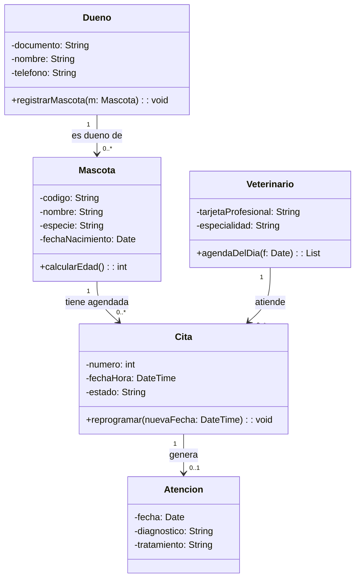

# VetCare - Modelo de dominio (diagrama de clases)

Proyecto Integrador: Clinica Veterinaria Huellitas.
Asignatura: Seminario de Sistemas. Herramientas: draw.io o Mermaid. Entrega: ExamLab.

---

## 1. Notacion minima que se exige

| Elemento | Como se escribe | Ejemplo VetCare |
|---|---|---|
| Clase | Sustantivo en singular, mayuscula inicial | Mascota |
| Atributo | visibilidad nombre: Tipo | -fechaNacimiento: Date |
| Metodo | visibilidad nombre(param): Retorno | +calcularEdad(): int |
| Visibilidad | - privado, + publico, # protegido | -documento: String |
| Asociacion | linea con nombre de relacion | Dueno es dueno de Mascota |
| Multiplicidad | 1 / 0..1 / 1..* / 0..* | Dueno 1 --- 0..* Mascota |
| Composicion | rombo relleno (la parte no vive sin el todo) | Mascota contiene sus Atenciones (historia clinica) |
| Agregacion | rombo vacio (la parte sobrevive sola) | Sede agrupa Veterinarios |
| Herencia | triangulo (solo si hay un 'es-un' real) | Persona <|-- Veterinario |

---

## 2. Clases del dominio VetCare

### Dueno
- -documento: String
- -nombre: String
- -telefono: String
- -direccion: String
- +registrarMascota(m: Mascota): void

### Mascota
- -codigo: String
- -nombre: String
- -especie: String
- -raza: String
- -fechaNacimiento: Date
- +calcularEdad(): int

### Veterinario
- -tarjetaProfesional: String
- -nombre: String
- -especialidad: String
- +agendaDelDia(f: Date): List

### Cita
- -numero: int
- -fechaHora: DateTime
- -motivo: String
- -estado: String
- +reprogramar(nuevaFecha: DateTime): void
- +cancelar(motivo: String): void

### Atencion
- -fecha: Date
- -diagnostico: String
- -tratamiento: String
- -observaciones: String
- +resumen(): String

---

## 3. Relaciones (leer en voz alta antes de aprobar)

| Origen | Mult. | Destino | Mult. | Se lee |
|---|---|---|---|---|
| Dueno | 1 | Mascota | 0..* | Un dueno puede tener cero o mas mascotas; una mascota pertenece a un unico dueno |
| Mascota | 1 | Cita | 0..* | Una mascota puede tener muchas citas; cada cita es de una sola mascota |
| Veterinario | 1 | Cita | 0..* | Un veterinario atiende muchas citas; cada cita la atiende un veterinario |
| Cita | 1 | Atencion | 0..1 | Una cita genera a lo sumo una atencion (si se cancela, ninguna) |

---

## 4. Version en Mermaid (para pegar en el documento)

---

## 5. Del diagrama al diccionario de datos (adelanto de la proxima clase)

| Clase | Tabla prevista | Campo | Tipo | Observacion |
|---|---|---|---|---|
| Dueno | dueno | documento | VARCHAR(15) | Llave primaria |
| Mascota | mascota | codigo | VARCHAR(10) | Llave primaria |
| Mascota | mascota | documento_dueno | VARCHAR(15) | Llave foranea (viene del 1 --- 0..*) |
| Cita | cita | fecha_hora | DATETIME | No se permiten dos citas del mismo veterinario a la misma hora |

---

## 6. Trazabilidad clase - requisito

| Clase | RF / Historia que la justifica |
|---|---|
| Dueno | RF-01 / HU-01 |
| Mascota | RF-02 / HU-02 |
| Cita | RF-05 / HU-06 |
| Atencion | RF-04 / HU-05 |
| Veterinario | RF-07 / HU-08 |

---

## 7. Checklist antes de subir a ExamLab

- [ ] Clases en singular y sin nombres de tabla ni de pantalla.
- [ ] Ninguna clase tecnica (DAO, Conexion, Login, Menu, Reporte).
- [ ] Todos los atributos tienen visibilidad y tipo.
- [ ] Ningun atributo repetido en dos clases.
- [ ] Las 4 relaciones tienen nombre y multiplicidad en los dos extremos.
- [ ] Cada relacion se leyo en voz alta y la frase es verdadera en Huellitas.
- [ ] Se suben los dos archivos: Diagrama-Clases-VetCare-<apellidos>.png y .drawio
