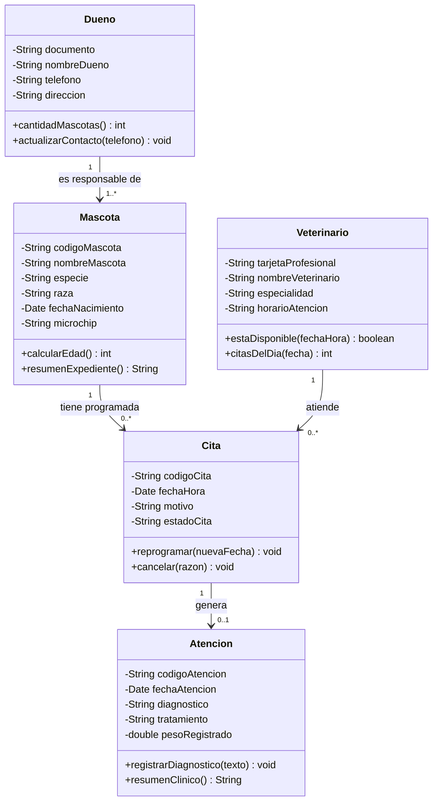
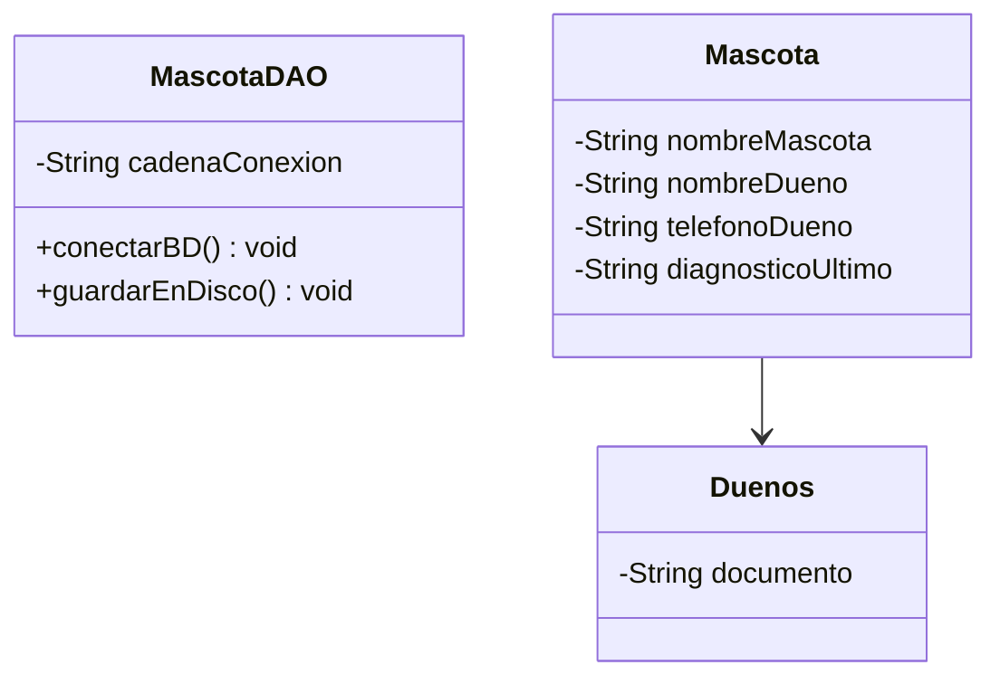
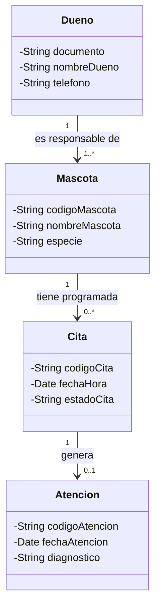

# Taller de la Clase 8 en ExamLab - configuracion

- **Curso:** Seminario de Sistemas (FI303301)
- **Taller:** Taller Clase 8 en ExamLab - Modelo de dominio de VetCare en UML
- **Preguntas:** 5 · **Total:** 100 puntos
- **Plataforma:** ExamLab (https://uniaj.examlab.workers.dev/) · modulo Talleres
- **Hito del PI:** Queda listo el modelo de dominio de VetCare: el diagrama de clases con Dueno, Mascota, Cita, Veterinario y Atencion.
- **Entregable de la clase:** Diagrama de clases de VetCare hecho en draw.io, exportado a PNG y al archivo .drawio, con 5 clases, atributos tipados, metodos propios y 4 asociaciones con multiplicidad y nombre de rol, subido a ExamLab.

> ExamLab no importa preguntas desde archivo: el alta se hace en la UI del
> docente (o con la pestana de IA). Este documento trae el texto exacto de cada
> campo para copiar y pegar, incluidos el SQL de partida y el codigo base.

**Que produce el estudiante:** El estudiante entrega el diagrama de clases de VetCare con 5 clases tipadas, 4 asociaciones con multiplicidad y rol, su trazabilidad a requisitos y la correccion de un modelo mal planteado.

---

## Pregunta 1 - Diagrama (Mermaid) · 40 pts

**Tipo en la plataforma:** `diagrama`

**Enunciado (campo Contenido):**

## Diagrama de clases del dominio de VetCare

Dibuje el modelo de dominio de VetCare con un **classDiagram de Mermaid**. Se renderiza aqui mismo: no necesita draw.io ni subir PNG.

**Clases obligatorias (exactamente estas 5, en singular y con mayuscula inicial):** `Dueno`, `Mascota`, `Cita`, `Veterinario`, `Atencion`.

**Atributos: minimo 4 por clase**, con **visibilidad y tipo**. Sintaxis Mermaid: el tipo va antes del nombre, por ejemplo `-String documento`, `-Date fechaNacimiento`, `-double pesoRegistrado`.
- **Ningun atributo puede repetirse en dos clases distintas.** Si necesita el nombre de la mascota y el del dueno, use nombres distinguibles (`nombreMascota`, `nombreDueno`).
- `Mascota` debe incluir `microchip` (lo exige RF-03) y `Atencion` debe incluir `diagnostico` (lo exige RF-06 y lo protege el RNF de control de acceso).

**Metodos: minimo 1 metodo propio del dominio por clase**, escrito como `+nombreMetodo(parametro) TipoRetorno`. Ejemplos validos: `+calcularEdad() int` en Mascota, `+reprogramar(nuevaFecha) void` en Cita, `+estaDisponible(fechaHora) boolean` en Veterinario. **Prohibidos** los metodos tecnicos: nada de `conectarBD`, `guardarEnDisco`, `abrirVentana`.

**Asociaciones: exactamente 4**, cada una con **multiplicidad en ambos extremos** y **nombre de relacion** legible como frase. Sintaxis: `Dueno "1" --> "1..*" Mascota : es responsable de`.
Las 4 relaciones que debe modelar, con la regla de negocio de Huellitas:
1. Un dueno es responsable de una o mas mascotas; una mascota tiene un solo dueno responsable.
2. Una mascota tiene programadas cero o muchas citas.
3. Un veterinario atiende cero o muchas citas.
4. Una cita genera como maximo una atencion (si el dueno no llego, la cita no genera atencion).

**No use clases tecnicas** (nada de DAO, Conexion, Login, Menu, Controller): esas no son del dominio de una clinica.

**Pegar al final del enunciado — flujo de entrega del diagrama:**

**Del boceto al codigo Mermaid.** No subas una imagen: la respuesta de esta pregunta es texto Mermaid.

- **1. Disena visual** Dibuja el diagrama como quieras en Excalidraw o draw.io: es mas rapido arrastrar cajas que escribir codigo, y ahi es donde piensas el modelo.
- **2. Traduce con IA** Copia o describe tu boceto a una IA y pidele el codigo Mermaid: «convierte este diagrama a Mermaid usando `classDiagram`». Revisa el resultado: la IA acierta la sintaxis, no tu modelo.
- **3. Pega y renderiza en ExamLab** Pega ese codigo en la caja de texto de la pregunta y mira como lo dibuja la plataforma. Si no renderiza, corrige ahi mismo: lo que se califica es el diagrama renderizado dentro de ExamLab.
- **4. Guarda el PNG para tu PI** Exporta tambien la imagen a la carpeta de tu Proyecto Integrador. Esa copia es para tu informe; no reemplaza la respuesta en la plataforma.

**Diagrama de referencia (Mermaid):**

**Rubrica esperada (campo Rubrica):**

Las 5 clases del dominio en singular, sin clases tecnicas. Minimo 4 atributos por clase con visibilidad y tipo y sin duplicados entre clases, incluyendo microchip en Mascota y diagnostico en Atencion. Minimo un metodo de dominio por clase, ninguno tecnico. Las 4 asociaciones exactas con multiplicidad en ambos extremos y nombre de relacion, coherentes con las reglas de negocio enunciadas.

---

## Pregunta 2 - Respuesta escrita · 20 pts

**Tipo en la plataforma:** `abierta`

**Enunciado (campo Contenido):**

## Sustantivos candidatos y trazabilidad de cada clase

**Parte A - Trazabilidad.** Escriba una tabla markdown con **5 filas** (una por clase del diagrama) y **estas 4 columnas**:

`| Clase | RF o HU que la exige | Frase del requisito o de la historia donde aparece el sustantivo | Atributo que la identifica de forma unica |`

Toda clase debe rastrearse a **al menos un RF del catalogo de la clase 6 o una historia de la clase 7**. Si una clase no se puede rastrear, sobra en el modelo y debe decirlo.

**Parte B - Sustantivos descartados.** Liste **exactamente 4 sustantivos** que aparecen en los requisitos o en las conversaciones de la clinica pero que **NO** deben convertirse en clases del dominio, y para cada uno diga en una linea **por que se descarta**, clasificandolo como: pantalla, reporte, elemento tecnico o atributo de otra clase. Candidatos que puede usar: pantalla de busqueda, listado de resultados, boton guardar, usuario y contrasena, base de datos, telefono del dueno, informe mensual de facturacion, cuaderno de citas.

**Parte C.** En un renglon, indique **cual clase agregaria en un siguiente incremento** (por ejemplo `Factura` o `Insumo`), a que RF responderia y con que clase se asociaria.

**Rubrica esperada (campo Rubrica):**

Tabla con las 5 clases, cada una rastreada a un RF o HU con la frase de origen citada y su atributo identificador. Cuatro sustantivos descartados con su razon y su clasificacion (pantalla, reporte, tecnico o atributo). El renglon final propone una clase futura con su RF y su asociacion.

---

## Pregunta 3 - Diagrama (Mermaid) · 15 pts

**Tipo en la plataforma:** `diagrama`

**Enunciado (campo Contenido):**

## Corrija este modelo mal planteado

Otro equipo entrego este diagrama de clases para VetCare. **Renderiza, pero esta mal modelado.**

**Entregue el diagrama corregido en Mermaid**, aplicando **estas 5 correcciones** (todas obligatorias):

1. Eliminar la clase tecnica y sus metodos tecnicos: no pertenecen al modelo de dominio.
2. Renombrar `Duenos` a `Dueno` (singular) y dejarle **minimo 3 atributos** con visibilidad y tipo.
3. Mover `nombreDueno` y `telefonoDueno` a la clase donde de verdad pertenecen.
4. Mover `diagnosticoUltimo` a `Atencion`, que se llega **a traves de Cita** (agregue las clases `Cita` y `Atencion` para que el diagnostico quede en su lugar y sea coherente con su diagrama principal).
5. Poner **multiplicidad en ambos extremos y nombre de relacion** en todas las asociaciones.

El resultado debe usar los mismos nombres de clase y de atributo que su diagrama de la primera pregunta.

**Pegar al final del enunciado — flujo de entrega del diagrama:**

**Del boceto al codigo Mermaid.** No subas una imagen: la respuesta de esta pregunta es texto Mermaid.

- **1. Disena visual** Dibuja el diagrama como quieras en Excalidraw o draw.io: es mas rapido arrastrar cajas que escribir codigo, y ahi es donde piensas el modelo.
- **2. Traduce con IA** Copia o describe tu boceto a una IA y pidele el codigo Mermaid: «convierte este diagrama a Mermaid usando `classDiagram`». Revisa el resultado: la IA acierta la sintaxis, no tu modelo.
- **3. Pega y renderiza en ExamLab** Pega ese codigo en la caja de texto de la pregunta y mira como lo dibuja la plataforma. Si no renderiza, corrige ahi mismo: lo que se califica es el diagrama renderizado dentro de ExamLab.
- **4. Guarda el PNG para tu PI** Exporta tambien la imagen a la carpeta de tu Proyecto Integrador. Esa copia es para tu informe; no reemplaza la respuesta en la plataforma.

**Diagrama de referencia (Mermaid):**

**Rubrica esperada (campo Rubrica):**

El diagrama corregido no contiene clases ni metodos tecnicos, usa Dueno en singular con minimo 3 atributos tipados, ubica nombreDueno y telefono en Dueno, deja el diagnostico en Atencion alcanzada a traves de Cita, y todas las asociaciones tienen multiplicidad en ambos extremos y nombre de relacion. Los nombres coinciden con el diagrama principal del estudiante.

---

## Pregunta 4 - Seleccion multiple · 10 pts

**Tipo en la plataforma:** `cerrada_multi`

**Enunciado (campo Contenido):**

## Verificacion: que NO es una clase del dominio

El equipo escribio una lista de clases candidatas para VetCare. Marque **todas** las que **NO** deben aparecer en un diagrama de clases de **dominio**.

**Opciones:**

- [ ] Veterinario
- [x] PantallaRegistrarMascota
- [x] ConexionMySQL
- [ ] Insumo
- [x] InformeMensualDeFacturacion
- [x] TelefonoDelDueno

**Rubrica esperada (campo Rubrica):**

Correctas: 1, 2, 4 y 5. La 1 es una pantalla, la 2 es un elemento tecnico de persistencia, la 4 es un reporte derivado y la 5 es un atributo de Dueno, no una clase. Las opciones 0 y 3 son clases legitimas del dominio veterinario.

---

## Pregunta 5 - Respuesta escrita · 15 pts

**Tipo en la plataforma:** `abierta`

**Enunciado (campo Contenido):**

## Lea sus relaciones en voz alta y defienda el modelo

**Parte A - Lectura de las 4 asociaciones.** Escriba las **4 asociaciones** de su diagrama como frases completas del negocio de Huellitas, usando esta plantilla literal y respetando la multiplicidad que dibujo:

`Un <ClaseA> <nombre de la relacion> <multiplicidad en palabras> <ClaseB>, y un <ClaseB> ...`

Ejemplo: «Un Dueno es responsable de una o mas Mascotas, y una Mascota tiene exactamente un Dueno responsable.» Si al leerla en voz alta la frase resulta falsa para la clinica, la multiplicidad esta mal y debe corregirla aqui.

**Parte B - Defensa de dos decisiones de modelado.** Responda en 2 renglones cada una:
1. ¿Por que `Atencion` es una **clase aparte** de `Cita` y no simplemente unos atributos mas dentro de `Cita`? Use como argumento algo que pase en la clinica (una cita puede no atenderse, una atencion tiene datos clinicos que solo el veterinario escribe).
2. ¿Por que `Mascota` no guarda el `telefono` del dueno, aunque la recepcionista lo necesite mientras ve la ficha del paciente? Explique el problema que aparece cuando el dueno cambia de numero.

**Parte C.** En un renglon: ¿que pasaria con el RNF de control de acceso si el `diagnostico` estuviera en `Mascota` en lugar de en `Atencion`?

**Rubrica esperada (campo Rubrica):**

Las 4 asociaciones leidas como frases verdaderas del negocio, con la multiplicidad expresada en palabras y coherente con el diagrama. Las dos defensas argumentan con hechos de la clinica (cita no atendida, dato duplicado que se desactualiza), no con teoria. El renglon final conecta la ubicacion del diagnostico con el control de acceso por rol.

---

## Al terminar de crearlo

- Verifique que la suma de puntos sea la esperada: **100**.
- Publique el taller y confirme la fecha limite (domingo 23:59 segun el Acuerdo).
- Las preguntas con SQL o codigo: ejecutelas una vez usted mismo antes de publicar,
  para confirmar que el SQL de partida corre y que el starter compila.
