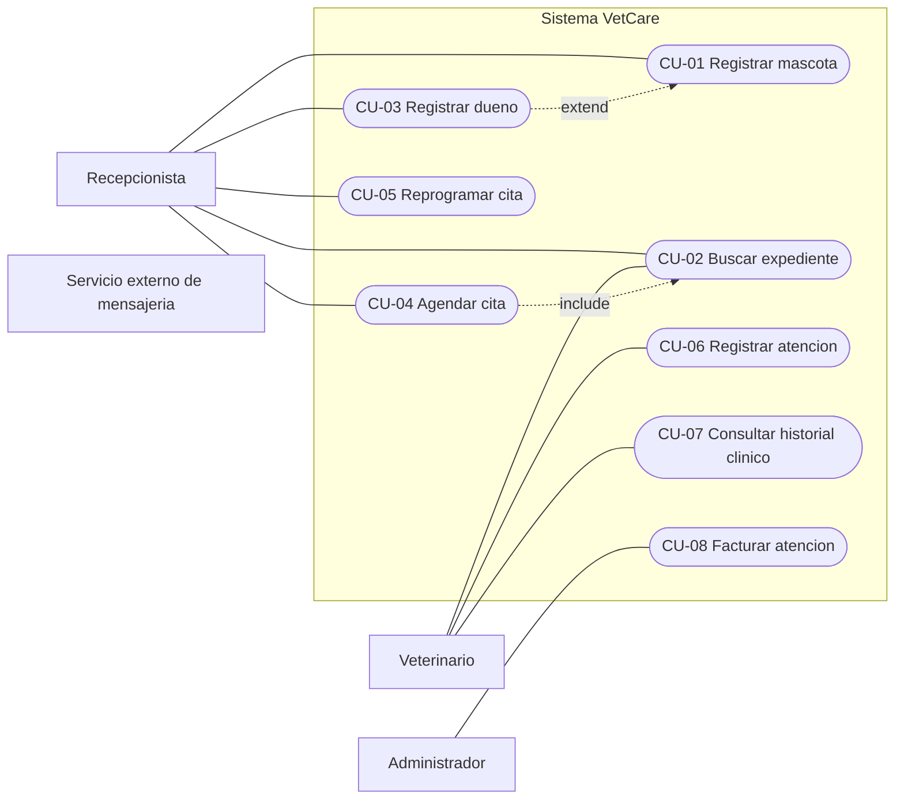

# Taller de la Clase 9 en ExamLab - configuracion

- **Curso:** Seminario de Sistemas (FI303301)
- **Taller:** Taller Clase 9 en ExamLab - Casos de uso de VetCare
- **Preguntas:** 5 · **Total:** 100 puntos
- **Plataforma:** ExamLab (https://examlab.lovable.app/) · modulo Talleres
- **Hito del PI:** Queda listo el diagrama de casos de uso de VetCare con su limite de sistema y la especificacion textual completa de Registrar mascota y Buscar expediente.
- **Entregable de la clase:** Un PDF con el diagrama de casos de uso, la matriz de trazabilidad RF a CU y las dos especificaciones textuales completas (precondiciones, postcondiciones, flujo principal y minimo dos flujos alternos cada una), subido a ExamLab.

> ExamLab no importa preguntas desde archivo: el alta se hace en la UI del
> docente (o con la pestana de IA). Este documento trae el texto exacto de cada
> campo para copiar y pegar, incluidos el SQL de partida y el codigo base.

**Que produce el estudiante:** El estudiante entrega el diagrama de casos de uso con limite de sistema, la matriz RF a CU sin huerfanos y las dos especificaciones textuales completas con flujos alternos.

---

## Pregunta 1 - Diagrama (Mermaid) · 25 pts

**Tipo en la plataforma:** `diagrama`

**Enunciado (campo Contenido):**

## Diagrama de casos de uso de VetCare

**Aviso honesto sobre la herramienta:** Mermaid **no tiene** un tipo nativo de diagrama de casos de uso (no dibuja monigotes ni elipses con limite de sistema). Lo vamos a representar con un `flowchart LR` que respeta la **semantica** de UML aunque no la forma exacta:

- **Actores**: nodos rectangulares `ACT[Nombre del rol]` ubicados **fuera** del subgraph.
- **Limite del sistema**: un `subgraph VC[Sistema VetCare]` que contiene todos los casos de uso.
- **Casos de uso**: nodos con forma de estadio `CU1([CU-01 Registrar mascota])` ubicados **dentro** del subgraph.
- **Asociacion actor - caso de uso**: linea sin punta `ACT --- CU1`.
- **include y extend**: flecha punteada rotulada `CU4 -.->|include| CU2`.

**Contenido obligatorio:**
1. **4 actores fuera del limite, como roles**: `Recepcionista`, `Veterinario`, `Administrador` y `Servicio externo de mensajeria` (este ultimo es actor secundario candidato y **hoy no se conecta a ningun caso de uso**: dejelo suelto a proposito). Prohibido usar nombres propios o cargos inventados.
2. **Entre 6 y 8 casos de uso** dentro del limite, derivados del catalogo RF-01 a RF-08, todos escritos como **verbo en infinitivo + objeto del dominio** y numerados `CU-01`, `CU-02`, ... **Prohibido** cualquier caso de uso llamado Guardar, Validar, Mostrar, Iniciar sesion o Menu principal.
3. **Exactamente 1 relacion include y exactamente 1 relacion extend**, con la direccion correcta: el include sale del caso base hacia el incluido (comportamiento **obligatorio**, siempre ocurre); el extend sale del caso extension hacia el caso base (comportamiento **condicional**, solo a veces).

Escriba los textos sin tildes.

**Diagrama de referencia (Mermaid):**



**Rubrica esperada (campo Rubrica):**

Limite del sistema rotulado como subgraph con 6 a 8 casos de uso dentro, todos como verbo en infinitivo mas objeto del dominio y ninguno con nombre de boton, pantalla u operacion tecnica. Los 4 actores estan fuera como roles y el servicio de mensajeria queda sin conexion. Existe exactamente un include y un extend, con la direccion correcta.

---

## Pregunta 2 - Respuesta escrita · 30 pts

**Tipo en la plataforma:** `abierta`

**Enunciado (campo Contenido):**

## Especificacion textual de CU-01 Registrar mascota

Aqui esta el verdadero valor del analisis: el diagrama es el indice, la especificacion es el contenido. Diligencie la plantilla **completa** de CU-01 usando **exactamente estos campos rotulados**:

```
CU-01 Registrar mascota
Actor primario:
Actores secundarios: (o Ninguno)
RF de origen:
Disparador: (que hecho de la clinica lo inicia)
Precondiciones: (minimo 2)
Postcondicion de exito:
Postcondicion de fracaso:
FLUJO PRINCIPAL (minimo 8 pasos numerados, en pares actor-sistema):
  1. El/La <actor> ...
  2. El sistema ...
  3. ...
FLUJO ALTERNO A (paso donde se desvia: 2a):
  2a.1 ...
  2a.2 ...
  2a.3 Retorna al paso 3 del flujo principal
FLUJO ALTERNO B (paso donde se desvia: 5a):
  5a.1 ...
  5a.2 ...
REGLA DE NEGOCIO APLICADA:
```

Exigencias:
- El flujo principal **alterna actor y sistema**: paso impar hace el actor, paso par responde el sistema. Nada de dos pasos seguidos del sistema.
- **Minimo 2 flujos alternos**, numerados **respecto al paso del flujo principal donde se desvian** (2a, 5a) y cada uno debe decir si **retorna** al flujo principal o si **termina** el caso de uso.
- Los dos flujos alternos obligatorios de este caso: **(A)** el dueno **no esta registrado** todavia, que es justamente donde aplica su relacion **extend** con CU-03; **(B)** el microchip digitado **ya existe** en otra mascota.
- Prohibido escribir pasos de interfaz («da clic en el boton azul») o de implementacion («hace un insert»). Los pasos describen **intencion y respuesta del sistema**.

**Rubrica esperada (campo Rubrica):**

Todos los campos de la plantilla diligenciados, con minimo 2 precondiciones y las dos postcondiciones (exito y fracaso) diferenciadas. Flujo principal de minimo 8 pasos alternando actor y sistema. Los dos flujos alternos exigidos (dueno no registrado y microchip duplicado) numerados respecto al paso donde se desvian, indicando retorno o terminacion. Sin pasos de interfaz ni de implementacion.

---

## Pregunta 3 - Respuesta escrita · 25 pts

**Tipo en la plataforma:** `abierta`

**Enunciado (campo Contenido):**

## Especificacion textual de CU-02 Buscar expediente

Diligencie la plantilla completa de **CU-02 Buscar expediente** con los **mismos campos** de la pregunta anterior (actor primario, actores secundarios, RF de origen, disparador, precondiciones, postcondicion de exito, postcondicion de fracaso, flujo principal, flujos alternos y regla de negocio).

Exigencias propias de este caso de uso:
- **Flujo principal: minimo 6 pasos** en pares actor-sistema. Debe quedar explicito **por que criterios se puede buscar**: nombre de la mascota, documento del dueno o numero de microchip.
- **Minimo 2 flujos alternos**, obligatoriamente estos dos, numerados respecto al paso donde se desvian:
  - **(A) Resultados multiples**: hay varias mascotas que se llaman igual. Diga **que columnas muestra el sistema para desambiguar** (minimo 3) y como sigue el flujo cuando el actor escoge una.
  - **(B) Sin resultados**: la busqueda no encuentra nada. Escriba el **mensaje exacto entre comillas** que muestra el sistema y **que opcion le ofrece** al actor para no dejarlo bloqueado.
- Agregue al final un campo extra:

```
RNF ASOCIADO: <ID del RNF de desempeno> - <como se mide en este caso de uso>
```

Ese RNF debe ser el de los 3 segundos con 5.000 mascotas y debe decir en que paso del flujo se mide.

**Rubrica esperada (campo Rubrica):**

Plantilla completa con flujo principal de minimo 6 pasos en pares actor-sistema y los tres criterios de busqueda explicitos. Los dos flujos alternos exigidos estan numerados respecto a su paso de desvio: resultados multiples con minimo 3 columnas de desambiguacion, y sin resultados con el mensaje exacto entre comillas y una salida ofrecida al actor. El campo RNF asociado indica el ID y el paso donde se mide.

---

## Pregunta 4 - Respuesta escrita · 10 pts

**Tipo en la plataforma:** `abierta`

**Enunciado (campo Contenido):**

## Matriz de trazabilidad RF a CU y tratamiento de huerfanos

Escriba una tabla markdown con **una fila por cada RF del catalogo (RF-01 a RF-08)** y **estas 4 columnas**:

`| RF | Caso de uso que lo realiza (ID y nombre) | Actor primario | Estado: Cubierto / Huerfano con decision |`

Reglas de cierre:
- **Todo RF** debe apuntar a **al menos un CU**. Si algun RF no tiene caso de uso, marquelo como `Huerfano` y escriba en la misma celda la **decision tomada**: se crea el CU en esta version, se aplaza al siguiente incremento o se elimina el RF (y por que).
- **Todo CU** de su diagrama debe nacer de **al menos un RF**. Agregue debajo de la tabla una lista de los CU que **no** tengan RF de origen y decida: se elimina el CU o se escribe el requisito faltante (si lo escribe, redactelo con la plantilla `El sistema debe permitir a <actor> <accion> <objeto>`).
- Cierre con 2 renglones rotulados `JUSTIFICACION DE INCLUDE Y EXTEND` explicando, para su unico include, **por que el comportamiento incluido siempre ocurre**, y para su unico extend, **bajo que condicion exacta** ocurre. Si no puede justificarlo, la flecha se elimina del diagrama y debe decirlo.

**Rubrica esperada (campo Rubrica):**

Tabla con las 8 filas de RF, cada una con su CU, actor y estado. Ningun huerfano queda sin decision escrita y ningun CU queda sin RF (o se documenta el requisito nuevo con la plantilla). Los 2 renglones finales justifican include como obligatorio y extend como condicional, nombrando la condicion exacta.

---

## Pregunta 5 - Seleccion unica · 10 pts

**Tipo en la plataforma:** `cerrada`

**Enunciado (campo Contenido):**

## Verificacion: include o extend

En VetCare, para **agendar una cita** la recepcionista **siempre** tiene que ubicar antes el expediente de la mascota. Ademas, **solo cuando el dueno no esta registrado**, hay que registrarlo antes de poder crear la mascota.

¿Cual pareja de relaciones modela correctamente esas dos situaciones?

**Opciones:**

- [ ] CU-04 Agendar cita extend CU-02 Buscar expediente, y CU-03 Registrar dueno include CU-01 Registrar mascota.
- [x] CU-04 Agendar cita include CU-02 Buscar expediente, y CU-03 Registrar dueno extend CU-01 Registrar mascota.
- [ ] Las dos deben ser include, porque ambas ocurren dentro del mismo flujo de trabajo de la recepcionista.
- [ ] Las dos deben ser extend, porque en los dos casos el actor podria decidir no hacerlas.

**Rubrica esperada (campo Rubrica):**

Correcta: la opcion 1. El include modela comportamiento obligatorio y siempre ejecutado (CU-04 Agendar cita include CU-02 Buscar expediente), y el extend modela comportamiento condicional que amplia un caso base solo bajo una condicion (CU-03 Registrar dueno extend CU-01 Registrar mascota).

---

## Al terminar de crearlo

- Verifique que la suma de puntos sea la esperada: **100**.
- Publique el taller y confirme la fecha limite (domingo 23:59 segun el Acuerdo).
- Las preguntas con SQL o codigo: ejecutelas una vez usted mismo antes de publicar,
  para confirmar que el SQL de partida corre y que el starter compila.
